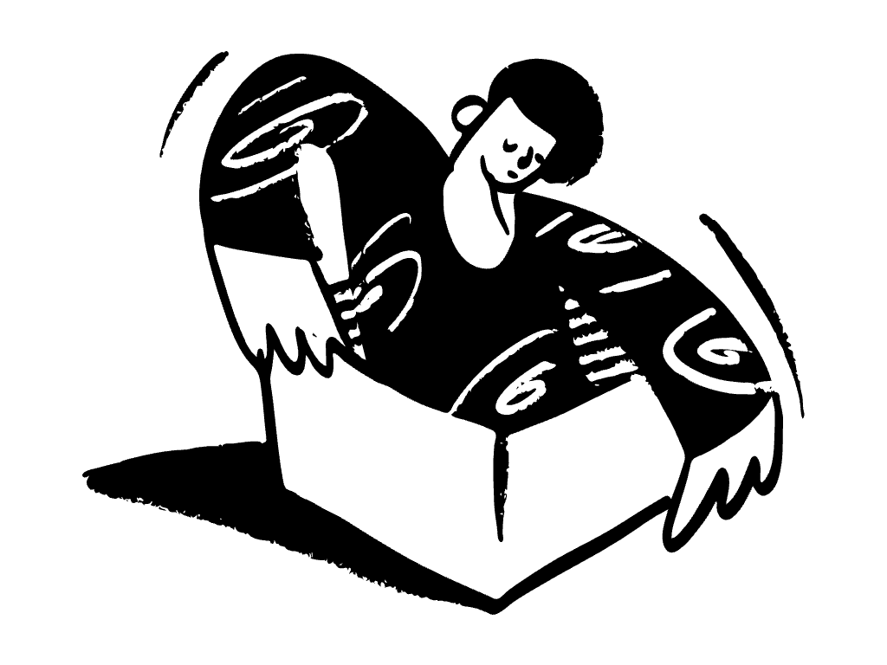

<!-- <CENTERED SECTION FOR GITHUB DISPLAY> -->

<div align="center">
<h1>Jotion</h1>
</div>

> A connected workspace where better, faster work happens. A full-stack Notion clone built with Next.js 14, Convex, and BlockNote.

>
> Real-time collaborative docs, nested pages, rich block editor, cover images, emoji icons, trash/restore, public publishing, and light/dark themes. <br />
> Built as a demonstration of modern full-stack patterns: server components, real-time sync, edge file storage, and third-party auth.
>
> | [](https://github.com/Aditya-PS-05) | Follow [@Aditya-PS-05](https://github.com/Aditya-PS-05) on GitHub for more projects. Hacking on full-stack apps, AI infrastructure, and developer tooling. |
> | :-----| :----- |

<div align="center">

[](https://nextjs.org/)
[](https://react.dev/)
[](https://www.typescriptlang.org/)
[](https://www.convex.dev/)
[](https://tailwindcss.com/)
[](https://github.com/Aditya-PS-05/Jotion/stargazers)
[](https://github.com/Aditya-PS-05/Jotion/network/members)
[](https://github.com/Aditya-PS-05/Jotion/issues)
[](https://github.com/Aditya-PS-05/Jotion/blob/master/LICENSE)

</div>

<!-- </CENTERED SECTION FOR GITHUB DISPLAY> -->

> **Try the live demo → [jotion.vercel.app](https://jotion.vercel.app/)** — sign in, create a document, drag a cover image, publish it to the web.

| Workspace | Document |
|:---:|:---:|
|  |  |

| Empty State |
|:---:|
|  |

> Start from a blank canvas, nest pages arbitrarily deep, drop in covers and icons, and share with a single toggle — the editor syncs in real time through Convex.

## Overview

**Jotion** is an opinionated Notion clone built to explore what a modern full-stack TypeScript app looks like when the backend, editor, and auth layers all get the "batteries-included" treatment. Instead of stitching together a REST API, a Postgres instance, an S3 bucket, and an auth service, Jotion leans on purpose-built primitives that each remove a category of work:

| Layer | Tool | What it gives you |
|-------|------|-------------------|
| **Frontend** | [Next.js 14 App Router](https://nextjs.org/) | Server components, route groups, streaming |
| **Backend** | [Convex](https://www.convex.dev/) | Real-time database + typed server functions |
| **Auth** | [Clerk](https://clerk.com/) | Drop-in sign-in, user management, JWT to Convex |
| **Editor** | [BlockNote](https://www.blocknotejs.org/) | Notion-style block editor with slash commands |
| **File Storage** | [EdgeStore](https://edgestore.dev/) | Signed-URL uploads for cover images |
| **UI** | [Tailwind](https://tailwindcss.com/) + [Radix](https://www.radix-ui.com/) + [shadcn/ui](https://ui.shadcn.com/) | Accessible primitives, composable styling |
| **State** | [Zustand](https://github.com/pmndrs/zustand) | Lightweight client state for modals and settings |

The result is a single codebase where creating a new collaborative, authenticated, file-uploading feature takes a few dozen lines instead of a sprint.

## Contents

- [Overview](#overview)
- [Features](#features)
- [Tech Stack](#tech-stack)
- [Installation](#installation)
  - [Prerequisites](#prerequisites)
  - [Quick Start](#quick-start)
  - [Environment Variables](#environment-variables)
- [Project Structure](#project-structure)
- [Usage](#usage)
- [Development](#development)
- [Deployment](#deployment)
- [Contributing](#contributing)
- [License](#license)

## Features

- **Real-Time Sync** — Every keystroke is persisted through Convex. Open the same doc in two tabs and watch them stay in lockstep.
- **Notion-Style Block Editor** — Slash commands, drag handles, nested blocks, code snippets, checklists, and rich media via BlockNote.
- **Infinite Nesting** — Create documents inside documents inside documents. Sidebar renders the full tree with collapse/expand.
- **Cover Images & Icons** — Unsplash-backed cover picker, emoji icon selector, and drag-to-upload via EdgeStore.
- **Trash & Restore** — Soft-delete documents to the archive, restore with one click, or permanently delete.
- **Publish to Web** — Toggle a document public and share a read-only link. Unauthenticated visitors see the rendered doc, not the editor.
- **Full-Text Search** — `⌘K` command palette searches across all your documents by title.
- **Dark & Light Mode** — System-aware theme via `next-themes`, persisted across sessions.
- **Authentication** — Clerk handles sign-in, sign-up, OAuth, and session management. JWTs flow into Convex for row-level auth.
- **Responsive Sidebar** — Collapsible on desktop, drawer on mobile, drag to resize.
- **Type-Safe End-to-End** — TypeScript across the client, server functions, and database schema.

## Tech Stack

**Framework & Runtime**
- Next.js 14 (App Router)
- React 18
- TypeScript 5

**Backend & Data**
- Convex (real-time database + server functions)
- Clerk (authentication)
- EdgeStore (file storage)

**UI & Editor**
- Tailwind CSS 3
- Radix UI primitives
- shadcn/ui components
- BlockNote editor
- Lucide icons
- Sonner (toasts)
- `emoji-picker-react`
- `react-dropzone`

**State & Utilities**
- Zustand (modal + settings stores)
- `usehooks-ts`
- `zod` (schema validation)
- `cmdk` (command palette)

## Installation

### Prerequisites

- [Node.js 18.17+](https://nodejs.org/) and npm
- A [Convex](https://www.convex.dev/) account (free tier is fine)
- A [Clerk](https://clerk.com/) account (free tier is fine)
- An [EdgeStore](https://edgestore.dev/) account (free tier is fine)

### Quick Start

```bash
# Clone the repo
git clone https://github.com/Aditya-PS-05/Jotion
cd Jotion

# Install dependencies
npm install

# Copy the env template and fill in keys from Convex, Clerk, EdgeStore
cp .env.example .env.local

# In one terminal: start the Convex dev server (generates types + deploys functions)
npx convex dev

# In another terminal: start Next.js
npm run dev
```

Open [http://localhost:3000](http://localhost:3000) and sign in.

### Environment Variables

Create a `.env.local` in the project root:

```bash
# Convex — from npx convex dev
NEXT_PUBLIC_CONVEX_URL=https://<your-deployment>.convex.cloud

# Clerk — from clerk.com dashboard
NEXT_PUBLIC_CLERK_PUBLISHABLE_KEY=pk_test_...
CLERK_SECRET_KEY=sk_test_...

# EdgeStore — from edgestore.dev dashboard
EDGE_STORE_ACCESS_KEY=...
EDGE_STORE_SECRET_KEY=...
```

You also need to wire Clerk as the JWT issuer for Convex. See `convex/auth.config.js` and follow the [Convex + Clerk guide](https://docs.convex.dev/auth/clerk).

## Project Structure

```
Jotion/
├── app/                      # Next.js App Router
│   ├── (marketing)/          # Public landing page
│   ├── (main)/               # Authenticated workspace
│   │   └── (routes)/documents/   # Document editor routes
│   ├── (public)/             # Published read-only docs
│   ├── api/                  # Route handlers (EdgeStore)
│   └── layout.tsx            # Root providers
├── components/               # Shared UI
│   ├── editor.tsx            # BlockNote wrapper
│   ├── cover.tsx             # Cover image component
│   ├── toolbar.tsx           # Title + icon + cover toolbar
│   ├── icon-picker.tsx       # Emoji picker
│   ├── search-command.tsx    # ⌘K palette
│   ├── modals/               # Settings, cover, confirm modals
│   ├── providers/            # Convex, theme, modal providers
│   └── ui/                   # shadcn/ui primitives
├── convex/                   # Convex backend
│   ├── schema.ts             # Document table schema
│   ├── documents.ts          # Queries + mutations
│   └── auth.config.js        # Clerk JWT integration
├── hooks/                    # React hooks (useOrigin, useSettings, etc.)
├── lib/                      # EdgeStore client, utils
└── public/                   # Static assets (logos, screenshots)
```

## Usage

| Action | How |
|--------|-----|
| **Create a document** | Sidebar `+ New page` or the inline `+` on any parent |
| **Nest a document** | Hover a sidebar item → click `+` to add a child |
| **Set icon** | Click the ghost icon slot above the title |
| **Set cover image** | Hover the top of the doc → `Add cover` |
| **Archive** | Sidebar `⋯` menu → `Delete` (goes to Trash, not permanent) |
| **Restore / purge** | Sidebar → `Trash` button → restore or delete permanently |
| **Publish** | Top-right `Publish` → toggle `Publish on the web` → copy share link |
| **Search** | `⌘K` (Mac) / `Ctrl+K` (Windows/Linux) |
| **Toggle theme** | Settings gear → `Appearance` |

## Development

```bash
# Dev server (Next.js)
npm run dev

# Dev server (Convex — run in parallel)
npx convex dev

# Production build
npm run build

# Start production server
npm start

# Lint
npm run lint
```

The Convex dev process watches `convex/*.ts`, generates types into `convex/_generated/`, and hot-pushes function updates. Keep it running alongside `npm run dev` so schema and function edits reflect instantly.

## Deployment

Jotion is deployed on Vercel at [jotion.vercel.app](https://jotion.vercel.app/). To deploy your own:

1. Push your fork to GitHub.
2. Import the repo into [Vercel](https://vercel.com/new).
3. Add the env vars from [Environment Variables](#environment-variables) to the Vercel project.
4. Run `npx convex deploy` once locally to create a production Convex deployment, then paste the production `CONVEX_DEPLOY_KEY` into Vercel so build-time deploys work.
5. Set the Clerk production instance's JWT template to match `convex/auth.config.js`.

Vercel handles the Next.js side; Convex handles the backend and realtime connections. No Docker, no servers to manage.

## Contributing

Issues and PRs are welcome. If you want to add a feature:

1. Fork the repo and create a feature branch (`feat/my-thing`).
2. Run `npm run lint` and make sure the Convex dev server doesn't complain about schema changes.
3. Open a PR describing the *why*, not just the *what*. Screenshots help for UI changes.

Please don't open PRs that merely bump dependencies without a reason tied to a bug or feature.

## License

<p align="center">
  <strong>MIT © <a href="https://github.com/Aditya-PS-05">Aditya Pratap Singh</a></strong>
</p>

If you find this project useful, **please consider starring it ⭐** or [follow me on GitHub](https://github.com/Aditya-PS-05) for more work on full-stack apps and developer tooling. Issues, PRs, and ideas all welcome.
